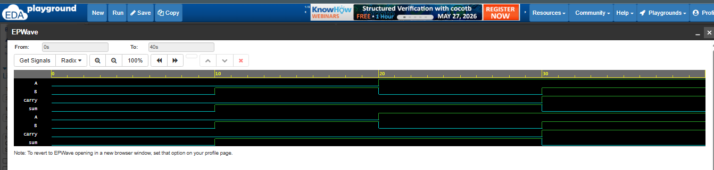

# Half Adder using Verilog

Refreshing my Verilog Basics!!

## Inputs
 -A
 -B

## Outputs
- Sum
- Carry

## Logic
- Sum = A XOR B
- Carry = A AND B

## Tools Used
- EDA Playground
- Icarus Verilog
- EPWave

## Waveform

## Author
Jesna Mary Mathews
